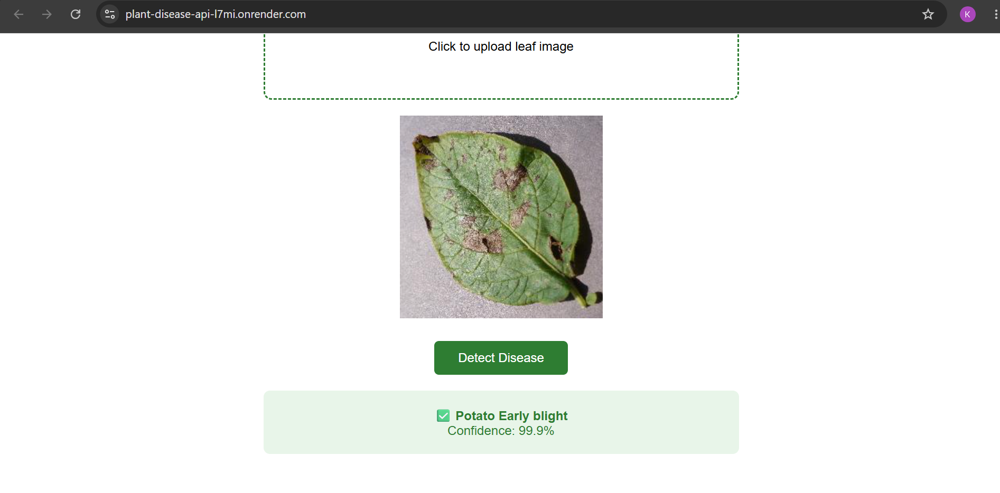

# 🌿 Plant Disease Detection API

An end-to-end deep learning system that detects diseases in plant leaves from a photo — using transfer learning on EfficientNetB0, deployed as a Flask REST API with Grad-CAM visual explainability.

**Live Demo:** [plant-disease-api-l7mi.onrender.com](https://plant-disease-api-l7mi.onrender.com)  
*(Free tier — allow 30–60 seconds for cold start)*

---

## 📌 The Problem

Plant diseases cause significant crop loss every year. Early detection matters — but farmers often can't identify a disease until it has already spread. The goal here was simple: **upload a photo of a leaf, get an instant diagnosis.**

The harder design question was: *what happens when the model isn't sure?* Most student projects ignore this. This one doesn't.

---

##  What Makes This Different

Two decisions separate this from a standard image classifier:

**1. Confidence thresholding**  
If the model's top prediction scores below 60% confidence, the API returns a warning instead of a class label — *"Low confidence — retake image in better lighting."*  
A wrong prediction with high confidence is worse than no prediction. This matters in real-world use.

**2. Grad-CAM explainability**  
The model doesn't just output a label — it highlights which part of the leaf influenced the prediction. This makes the system interpretable, not just accurate.

---

##  Supported Classes (15 total)

**Pepper Bell:** Bacterial Spot, Healthy  
**Potato:** Early Blight, Late Blight, Healthy  
**Tomato:** Bacterial Spot, Early Blight, Late Blight, Leaf Mold, Septoria Leaf Spot, Spider Mites, Target Spot, Mosaic Virus, Yellow Leaf Curl Virus, Healthy

---

##  Dataset

**Source:** PlantVillage Dataset (via Kaggle)  
**Total images:** 20,619 across 15 classes  
**Split:** 80% training (16,496) / 20% validation (4,123)  
**Input size:** 224×224 RGB

Notable class imbalance: Potato Healthy had only 152 images vs Tomato Yellow Leaf Curl Virus with 3,209. The model still generalised well across all classes.

---

## 🏗️ Model Architecture

Transfer learning with **EfficientNetB0** pretrained on ImageNet.

```
Input (224×224×3)
→ EfficientNetB0 frozen base (4,049,571 params — not trained)
→ GlobalAveragePooling2D
→ Dropout(0.2)
→ Dense(15, softmax)
```

**Total params:** 4,068,786  
**Trainable params:** 19,215 (only the classification head)

Why EfficientNetB0 and not a custom CNN?  
The previous project (CIFAR-10) used a custom CNN on 32×32 images. At that resolution, EfficientNetB0 causes spatial collapse — the feature maps shrink to near-zero size before pooling. PlantVillage images at 224×224 are the right size for transfer learning to actually work. Different problem, different tool.

---

##  Tech Stack

| Layer | Tool |
|---|---|
| Deep Learning | TensorFlow, Keras |
| Base Model | EfficientNetB0 (ImageNet weights) |
| Explainability | Grad-CAM |
| API | Flask |
| Server | Gunicorn |
| Container | Docker |
| Deployment | Render |

---

##  Training

Phase 1 (frozen base, classification head only):

| Epoch | Train Accuracy | Val Accuracy |
|---|---|---|
| 1 | 74.2% | 85.3% |
| 5 | 91.9% | 91.6% |
| 7 | 92.5% | 93.2% ← best |
| 10 | 93.2% | 93.1% |

**Final validation accuracy: 93.09%**  
**Validation loss: 0.2126**

Phase 2 (fine-tuning unfrozen layers) was evaluated but skipped — the model had already plateaued at epoch 7-8. Unfreezing would risk overfitting with minimal accuracy gain.

---

##  Per-Class Accuracy

| Class | Accuracy |
|---|---|
| Pepper Bell Healthy | 1.00 |
| Potato Early Blight | 0.99 |
| Tomato Healthy | 0.99 |
| Potato Late Blight | 0.98 |
| Tomato Yellow Leaf Curl Virus | 0.98 |
| Potato Healthy | 0.97 |
| Pepper Bell Bacterial Spot | 0.97 |
| Tomato Septoria Leaf Spot | 0.93 |
| Tomato Mosaic Virus | 0.93 |
| Tomato Target Spot | 0.93 |
| Tomato Late Blight | 0.92 |
| Tomato Spider Mites | 0.88 |
| Tomato Leaf Mold | 0.86 |
| Tomato Bacterial Spot | 0.91 |
| **Tomato Early Blight** | **0.60** ← hardest class |

Tomato Early Blight at 60% is the weakest class — its symptoms (brown spots with yellow rings) are visually similar to Septoria Leaf Spot and Target Spot. Grad-CAM on uncertain Early Blight predictions shows diffuse activation across the whole leaf instead of focusing on lesions — a genuine visual ambiguity, not a model bug.

---

##  Grad-CAM Explainability

Grad-CAM visualises which leaf regions the model focused on when making a prediction. This matters for trust — a model that highlights the right lesion area is more credible than one that accidentally got the right answer.

The last convolutional layer used: `top_conv` inside EfficientNetB0.

---

##  API Usage

**Endpoint:** `POST /predict`  
**Input:** multipart form-data with key `image`  
**Output:** JSON

Confident prediction:
```json
{
  "predicted_class": "Tomato_Late_blight",
  "confidence": 0.9423,
  "warning": null
}
```

Low confidence (below 0.60 threshold):
```json
{
  "predicted_class": null,
  "confidence": 0.4821,
  "warning": "Low confidence — retake image in better lighting"
}
```

Health check: `GET /health` → `{"status": "running"}`

---

## 📁 Repo Structure

```
CNN_Projects/Plant_village/
│
├── plant_village.ipynb       # Training, evaluation, Grad-CAM notebook
├── app.py                    # Flask REST API
├── best_model.keras          # Trained model weights
├── templates/                # HTML frontend
├── Dockerfile                # Container config
├── requirements.txt          # Dependencies
└── README.md
```

---

##  Run Locally

**Option 1 — Python**
```bash
git clone https://github.com/Kuldip-Lakhtariya/CNN_Projects.git
cd CNN_Projects/Plant_village
pip install -r requirements.txt
python app.py
```
Visit `http://localhost:5000`

**Option 2 — Docker**
```bash
docker build -t plant-disease-api .
docker run -p 5000:5000 plant-disease-api
```

## Demo
Upload a leaf image → get disease prediction + confidence score



---

##  Key Learnings

- **Transfer learning needs the right input size.** EfficientNetB0 at 32×32 (CIFAR-10) caused spatial collapse. At 224×224 it works exactly as intended — the features it learned on ImageNet are actually useful at this resolution.
- **Confidence thresholding is a production decision, not a model decision.** The model always outputs a probability. Deciding what to do with low-confidence outputs is a system design choice. In a healthcare or agriculture context, a wrong confident answer is worse than no answer.
- **When Grad-CAM shows diffuse activation, the model is genuinely uncertain.** Tomato Early Blight at 54% confidence showed activation spread across the whole leaf — the model wasn't focusing on anything specific. That's a signal the disease signatures are visually ambiguous, not that the code is wrong.
- **Phase 2 fine-tuning isn't always needed.** Monitoring the val accuracy curve before deciding to unfreeze layers saved overfitting risk. The decision to skip Phase 2 was data-driven, not lazy.

---

##  Planned Improvements

- [ ] More interactive frontend — drag-and-drop upload, real-time confidence bar, Grad-CAM overlay displayed in browser
- [ ] File type validation in API (currently accepts any file at the route level)
- [ ] Extend to more crop types beyond tomato, potato, pepper bell

---

## 👤 Author

**Kuldip Lakhtariya**  
B.Tech ECE — LD College of Engineering, Ahmedabad  
[GitHub](https://github.com/Kuldip-Lakhtariya) · [LinkedIn](https://www.linkedin.com/in/kuldip-lakhtariya-957106371/]) · kuldip2611lakhtariya@gmail.com
